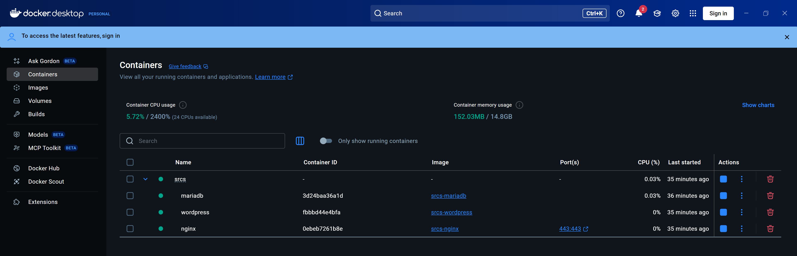
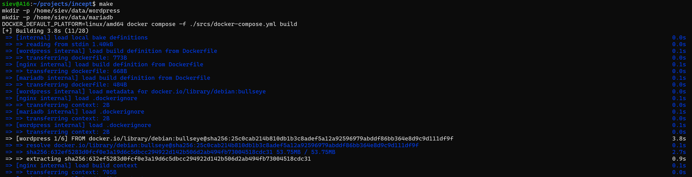
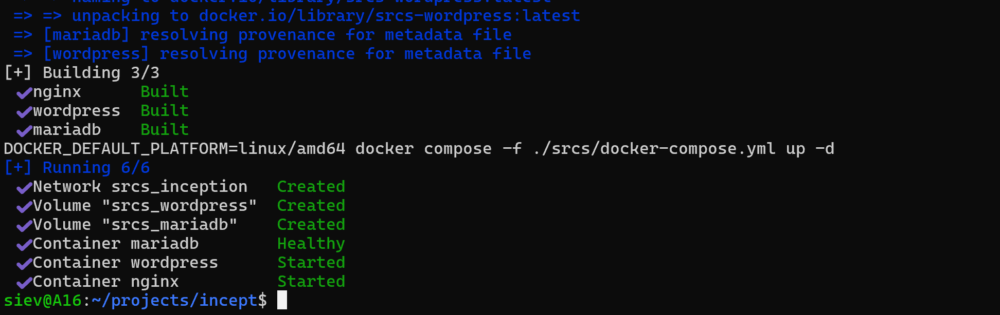
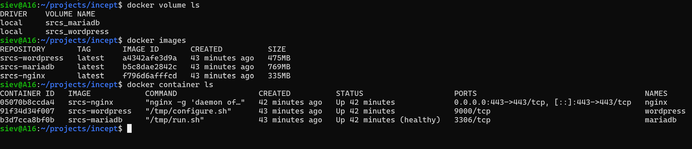
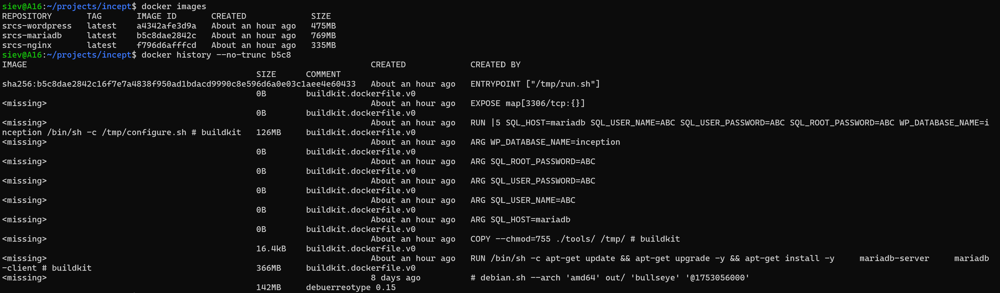
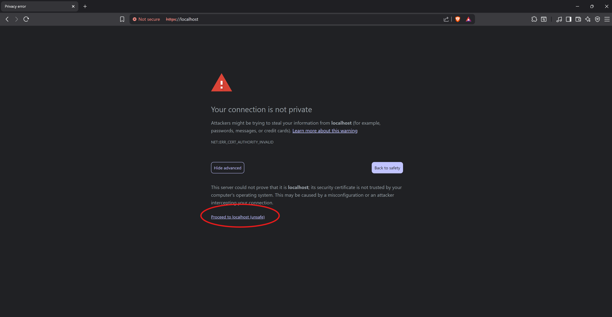
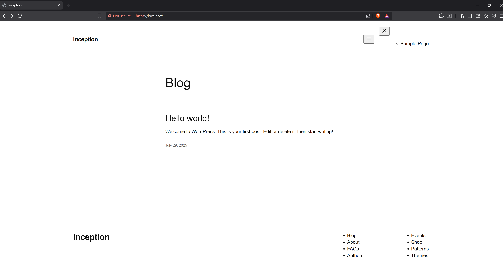
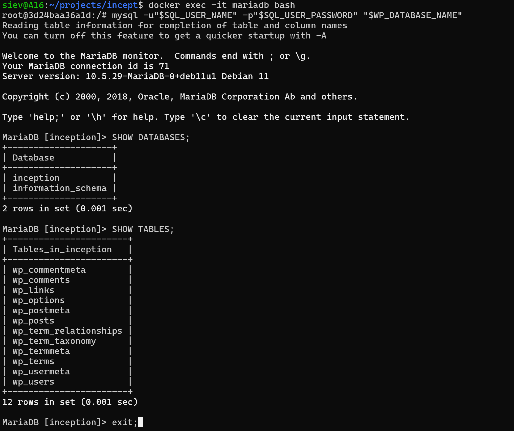
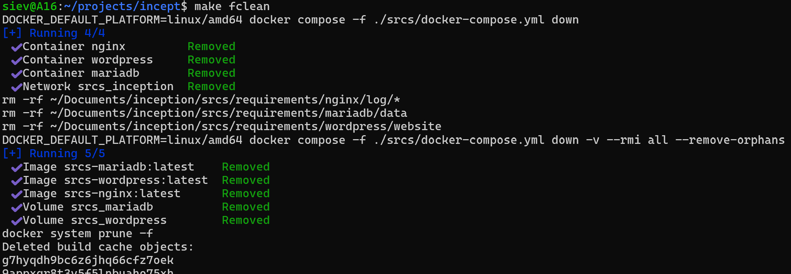

<h1 align="center">Inception - Docker Infrastructure Project</h1>

A project to build a secure, scalable web infrastructure using Docker, by creating custom images from scratch and orchestrating multiple containers with Docker Compose.

<h2>📌 Table of Contents</h2>
<ul>
  <li><a href="#about">About</a></li>
  <li><a href="#features">Features</a></li>
  <li><a href="#installation">Installation</a></li>
  <li><a href="#usage">Usage</a></li>
  <li><a href="#screenshots">Screenshots</a></li>
</ul>

<h2 id="about">📖 About</h2>

This project focused on building a secure, scalable web infrastructure using Docker. The goal is to create custom Docker images from scratch and orchestrate multiple containers (Nginx, WordPress, MariaDB) with Docker Compose, ensuring data persistence, network isolation, and automated deployment.

<h2 id="features">📦 Features</h2>
<ul>
  <li>Custom Dockerfiles for each service (Nginx, WordPress, MariaDB)</li>
  <li>Secure configuration with environment variables and Docker secrets</li>
  <li>Data persistence using Docker volumes</li>
  <li>Network isolation between containers</li>
  <li>Automated orchestration with Docker Compose</li>
</ul>

<h2 id="about">🛠️ Installation</h2>
 
> **Prerequisite:**  
> Make sure you have Docker Desktop or Docker Engine installed on your computer before running the commands below.

<pre><code class="bash">
make
</code></pre>

 
<em>Running <code>make</code> to build and start all services using Docker Compose.</em>

 
<em>If successful, all Docker images, networks, volumes, and containers will be created and started automatically.</em>

<h3>🪐 Containers Overview</h3>

<strong>WordPress:</strong> The main web application, available at <code>http://localhost</code> or your configured domain. 
<strong>Nginx:</strong> Acts as a reverse proxy for WordPress. 
<strong>MariaDB:</strong> Serves as the database backend (not directly accessible via browser).

<h2 id="screenshots">📸 Screenshots</h2>

<h4>Simple docker commands 🤖</h4>

 
<em>Use <code>docker volume ls</code> to see all Docker volumes created for persistent data storage.</em> 
<em>Use <code>docker images</code> to list all Docker images built for your services.</em> 
<em>Use <code>docker container ls</code> to display all running containers for your project.</em> 

<h4>Docker history for custom images 📜</h4>

 
<em>For this project, usage of base images is prohabited, like nginx:alpine or wordpress:latest.</em>  
<em>Instead, we have to start from a minimal image (like alpine or debian) and install/configure everything using Dockerfile.</em> 

<h4>WordPress Home 🌐</h4>

 
 
<em> Just ignore the self-signed SSL certificate warning. Access your site at <code>http://localhost</code>.</em>

<h4>MariaDB ⛁</h4>

 
<em>To interact with MariaDB, log in through the terminal using the <code>mysql</code> client or <code>docker exec</code> into the container. The database is not accessible via browser.</em>

<h4>Cleanup 🧹</h4>

 
<em>To perform a full cleanup, this commit removes all Docker images, containers, networks, and volumes created by the project. Use the <code>make fclean</code> target to reset your Docker environment completely.</em>

